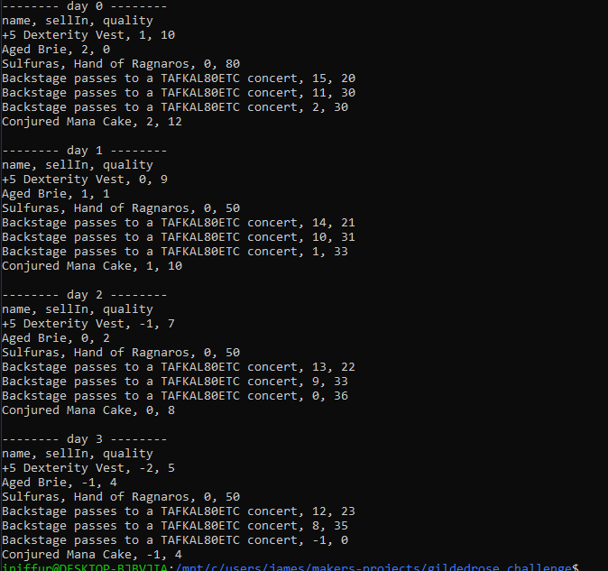

# Gilded Rose

## Description

This is a solution to the well know kata, the Gilded Rose kata written in JavaScript and tested with Jest.

My plan to refactor the 'legacy codebase' given was to seperate the updates for specific types of items into seperate functions, and call them all onto the `updateQuality` function. This enabled me to simply add and implement the request function to handle actions made to a new type of 'Conjured' item.

## Getting started

Install dependencies

```sh
npm install
```

Run tests using: 

```sh
npm test
npm run test:coverage
```

The original file provided is kept in `original_file.js` while the refactored class is kept in `gilded_rose.js`. The `texttest_fixture.js` file can be used to demonstrate how the `updateQuality` function runs and can be interacted with using node, with an output being seen below: 


