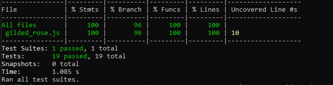

# Gilded Rose

## Description

This is a solution to the well know kata, the Gilded Rose kata written in JavaScript and tested with Jest.

My plan to refactor the 'legacy codebase' given was to split the updates for specific types of items into separate functions and call them all onto the `updateQuality` function. This enabled me to simply add and implement the request function to handle actions made to a new type of `Conjured` item. I approached this task by initially testing individual functions and making sure items were accurately being updated - being left with a test coverage of 100%



## Requirements

- Once the sell by date has passed, Quality degrades twice as fast
- The Quality of an item is never negative
- “Aged Brie” actually increases in Quality the older it gets
- The Quality of an item is never more than 50
- “Sulfuras”, being a legendary item, never has to be sold or decreases in Quality
- “Backstage passes”, like aged brie, increases in Quality as it’s `SellIn` value approaches; Quality increases by 2 when there are 10 days or less and by 3 when there are 5 days or less but Quality drops to 0 after the concert

We have recently signed a supplier of conjured items. This requires an update to our system:

* “Conjured” items degrade in Quality twice as fast as normal items

## Getting started

Install dependencies

```sh
npm install
```

Run tests using: 

```sh
npm test
npm run test:coverage
```

The original file provided is kept in `original_file.js` while the refactored class is kept in `gilded_rose.js`. The `texttest_fixture.js` file can be used to demonstrate how the `updateQuality` function runs and can be interacted with using node, with the output being seen below: 


This output is in line with the given requirements shown above.
